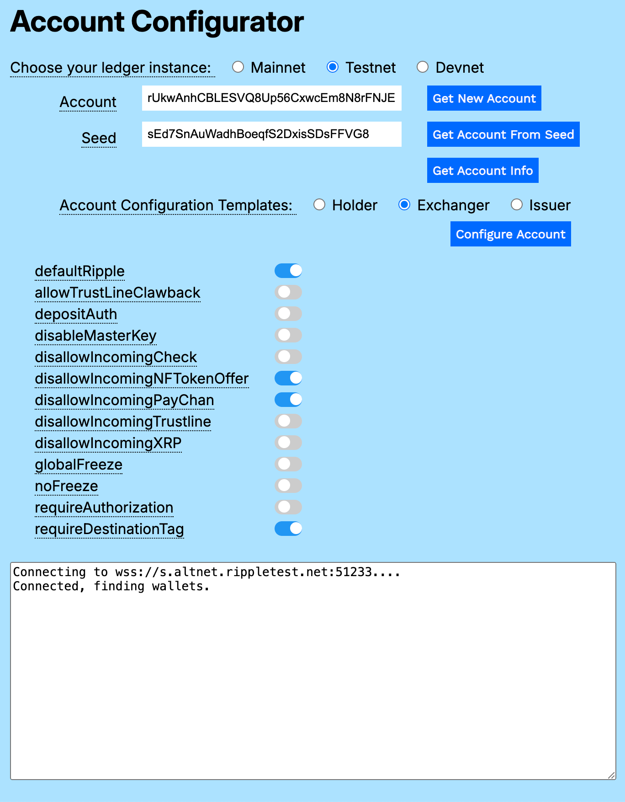
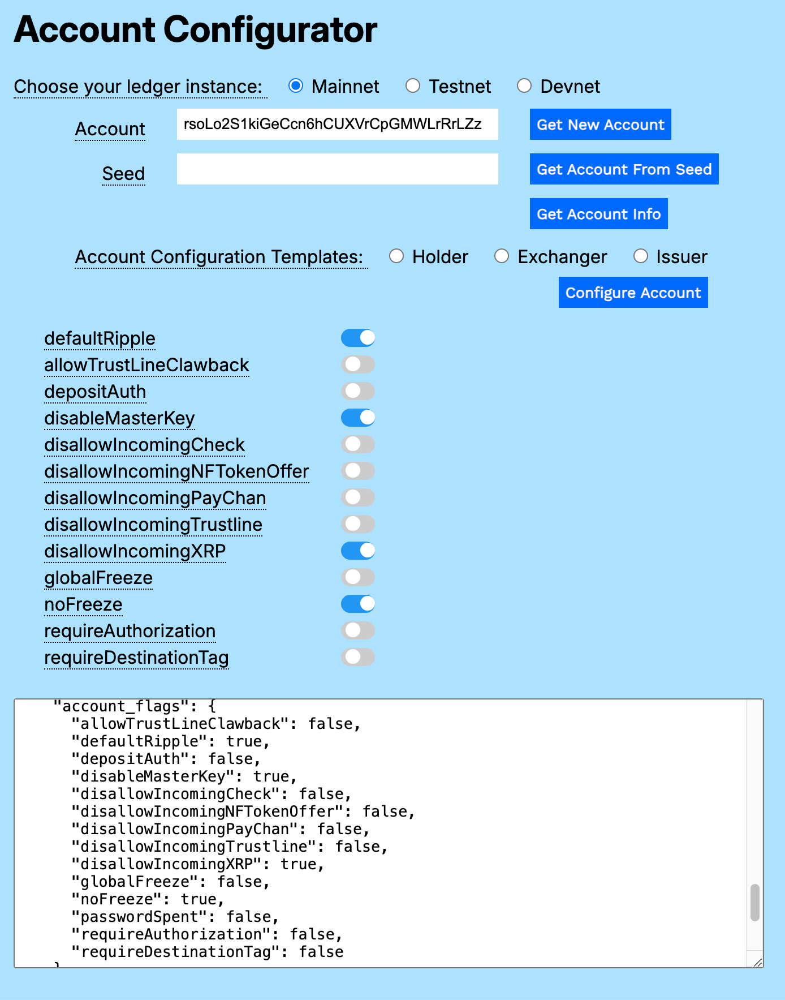

---
seo:
    description: Common configurations for an XRP Ledger account.
labels:
  - Accounts
  - Configuration
---
# Configuring Accounts

There are three basic account configurations on the XRP Ledger.

- [Holder](#holder)
- [Exchanger](#exchanger)
- [Issuer](#issuer)

Each of these accounts has different operational and security requirements for their function. You can start by configuring special behaviors that support the use case for each.

You can use the [Account Configurator](#using-the-account-configurator) to create new accounts on Testnet or Devnet and try out different permissions and configurations. You can also get information about accounts on Mainnet and see their real time settings.

## Holder

To configure an account that is essentially going to hold and spend value on the XRPL, you can use the default settings that come with a new account. No special configuration is required.

## Exchanger

If the primary purpose of an account is to facilitate exchange of value between third parties, you will likely start with these four settings:

| Flag | Description |
|------|-------------|
| `defaultRipple` | Allow rippling on trust lines by default. Rippling is necessary in order for accounts to trade tokens you exchange with third-party accounts. See [Rippling](../../tokens/fungible-tokens/rippling). |
| `disallowIncomingNFTokenOffer` | Prevent other accounts from sending NFT buy or sell offers to this account. This avoids unsolicited offers unrelated to the primary purpose of the exchanger account. See [Trading NFTs](../../tokens/nfts/trading). |
| `disallowIncomingPayChan` | Prevent other accounts from creating payment channels to this account. While you might want to create payment channels to other accounts yourself, you typically wouldn't want other accounts to create a payment channel to an exchange account. See [Payment Channels](../../payment-types/payment-channels). |
| `requireDestinationTag` | Require that all incoming payments have a destination tag. Destination tags provide a more lightweight mechanism for sending payments to a specific customer at a general receiver account. See [Source and Destination Tags](../../transactions/source-and-destination-tags). |

## Issuer

An account intended for issuing tokens requires configuration of both fields and flags in the `Account` object.

### Issuer Fields

| Field | Description |
|-------|-------------|
| `Domain` | The domain is the URL to the server where you serve the xrp-ledger.toml file. It is recommended that you serve a human-readable website from the same domain as the xrp-ledger.toml file. The website can provide further information about your identity and how you use the XRP Ledger, which helps to build trust toward you and your services. See [Domain](../../references/xrp-ledger-toml.md). |
| `TransferRate` | The `TransferRate` value specifies a fee to charge whenever counterparties transfer the currency you issue. The value is sent in 1 billion units. For example, 1200000000 represents a transfer fee of 20%. Note that the values  _0_ and _1000000000_ represent the default (no fee); if you explicitly set either value, the value is not stored, but assumed. See [Transfer Fees](../tokens/transfer-fees/). |
| `TickSize` | The `TickSize` value truncates the number of significant digits in the exchange rate of an offer when it gets placed in an order book. See [TickSize](../tokens/decentralized-exchange/ticksize/). |

### Signers

Multi-signing in the XRP Ledger is a method of authorizing transactions by using a combination of multiple secret keys. You create a list of signer accounts. Each signer has a weight, representing the relative authority of that signer account. The signer quorum represents the minimum weight total required to authorize a transaction. For example, if Ashad and Betty each have a signer weight of 1, Ceresia has a signer weight of 2, and the signer quorum is 3, Ashad and Ceresia can approve a transaction (weight total of 3), Betty and Ceresia can approve a transaction (weight total of 3), but Ashad and Betty cannot approve a transaction on their own (their combined signer weight is 2, 1 less than the required signer weight). See [Multi-Signing](./multi-signing).

### Issuer Flags

| Flag | Description |
|------|-------------|
| `defaultRipple` | Allow rippling on trust lines by default. Rippling is necessary in order for accounts to trade tokens you issue through this account. See [Rippling](../../tokens/fungible-tokens/rippling). |
| `depositAuth` | Deposit Authorization prevents unauthorized third parties from sending you payments. See [Deposit Authorization](./depositauth).
| `disallowIncomingCheck` | Prevent other accounts from sending checks to this account. See [Checks](../payment-types/checks/).
| `disallowIncomingNFTokenOffer` | Prevent other accounts from sending NFT buy or sell offers to this account. This avoids unsolicited offers unrelated to the primary purpose of the exchanger account. See [Trading NFTs](../../tokens/nfts/trading). |
| `disallowIncomingPayChan` | Prevent other accounts from creating payment channels to this account. While you might want to create payment channels to other accounts yourself, you typically wouldn't want other accounts to create a payment channel to an exchange account. See [Payment Channels](../../payment-types/payment-channels). |
| `disallowIncomingXRP` | Prevent other accounts from sending XRP to this account. (This is advisory, and not enforced by the protocol). See [Direct XRP Payments](../payment-types/direct-xrp-payments/). |

## Other Configuration Flags

All of the configuration flags can be helpful for specific use cases. The following are the account configuration flags not used in the standard Holder, Exchanger, and Issuer configurations.

| Flag | Description |
|------|-------------|
| `allowTrustLineClawback` | Allow account to claw back tokens it has issued. See [Clawing Back Tokens](../../tokens/fungible-tokens/clawing-back-tokens). |
| `disableMasterKey` | Disallow use of the master key pair. Can only be enabled if the account has configured another way to sign transactions, such as a regular key or a signer list. See [Master Key Pair](./cryptographic-keys#master-key-pair). |
| `disallowIncomingTrustLine` | Block incoming trust lines. See [Trust Lines](../tokens/fungible-tokens#trust-lines). |
| `globalFreeze` | Freeze all tokens issued by this account. See [Global Freeze](../tokens/fungible-tokens/freezes#global-freeze).
| `noFreeze` | Permanently remove the ability to freeze individual trust lines or end a global freeze. See [Freezing Tokens](../tokens/fungible-tokens/freezes). |
| `requireAuthorization` | Requires authorized trust lines for other accounts to hold tokens issued by this account. See [Authorized Trust Lines](../tokens/fungible-tokens/authorized-trust-lines).

## Using the Account Configurator

You can download a copy of the [Account Configurator](../../../_code-samples/account-configurator/account-configurator.zip) from the `_code_samples` directory.

Expand the archive and open `account_configurator.html` in a browser window.

### Getting Account Information

You can use the Account Configurator to view information about accounts on Mainnet, Testnet, and Devnet.

#### To get Account information

1. Choose the account's ledger instance (_Mainnet_, _Testnet_ or _Devnet_).
2. Enter the account number in the **Account** field.
3. Click **Get Account Info**.

The response is displayed in the **Results** field.

### Getting a New Account

You can create sandbox accounts on _Testnet_ or _Devnet_. To create an account on _Mainnet_, see [Creating Accounts](../accounts#creating-accounts).

#### To get a new Account

1. Choose the account's ledger instance (_Testnet_ or _Devnet_).
2. Click **Get New Account**.

Be sure to capture the **Seed** value for your new account so that you can easily retrieve it.

### Getting an Account from Its Seed

You can reload information for an existing account based on its seed value.

#### To get an account from its seed

1. Choose the account's ledger instance (_Testnet_ or _Devnet_).
2. Enter the value in the **Seed** field.
3. Click **Get Account From Seed**.

### Configuring a Holder Account

A Holder account requires no configuration (default settings). If the account previously had configuration changes, you can revert them and return the account to default status.

#### To configure a Holder account

1. Choose the account's ledger instance (_Testnet_ or _Devnet_).
2. Click **Get New Account**
   OR
   1. Enter the value in the **Seed** field.
   2. Click **Get Account From Seed**.
3. Choose the _Holder_ **Account Configuration Template**.
4. Click **Configure Account**.

If the account has never been configured, the response in the **Results** field is identical to the original account information, less the nominal transaction fee.

### Configuring an Exchanger Account

The standard Exchanger account configuration requires only four flags.

#### To configure an Exchanger account

1. Choose the account's ledger instance (_Testnet_ or _Devnet_).
2. Click **Get New Account**.
   OR  
   1. Enter a value in the **Seed** field.
   2. Click **Get Account From Seed**.
3. Choose the _Exchanger_ **Account Configuration Template**.
   The configuration flag checkboxes update with the 4 standard configuration choices. You can choose more or fewer configuration settings to customize the account to your needs.
4. Click **Configure Account**.

### Configuring an Issuer Account

Configure an Issuer account by filling in additional fields and selecting flags that serve your needs.

#### To configure an Issuer account

1. Choose the account's ledger instance (_Testnet_ or _Devnet_).
2. Click **Get New Account**.
   OR  
   1. Enter a value in the **Seed** field.
   2. Click **Get Account From Seed**.
3. Choose the _Issuer_ **Account Configuration Template**.
   The configuration flag checkboxes update with the 6 standard configuration choices. You can choose more or fewer 
   configuration settings to customize the account to your needs.
4. Enter the **Domain**, a URL to the server where your `xrp-ledger.toml` resides. Note that you enter a human readable URL, which is converted to a hexidecimal string when you get the account information. If you want to reconfigure the account, you'll need to re-enter the **Domain** URL.
5. Enter the **Transfer Rate**, a percentage fee to charge whenever counterparties transfer the currency you issue.
6. Enter the **Tick Size**, which truncates the number of significant digits in the exchange.
7. If you choose to include signers, this example module requires that you add valid account IDs in **Signer1 Account**, **Signer2 Account**, and **Signer3 Account**, a **Signer Weight** for each, and a **Signer Quorum** value. 
8. Click **Configure Account**.

Admitting to laziness on the author's part (and avoiding scope creep), setting Signers for an account requires changing all of them in a single transaction. The additional programming required to allow for an indeterminate number of signers and updates to individual signer weights is not essential to understanding account configuration. The sample code is easy to manipulate if you want your own example to add more or fewer than 3 signers.

### Removing Signers

Click **Remove Signers** to remove all signers for the current account.


