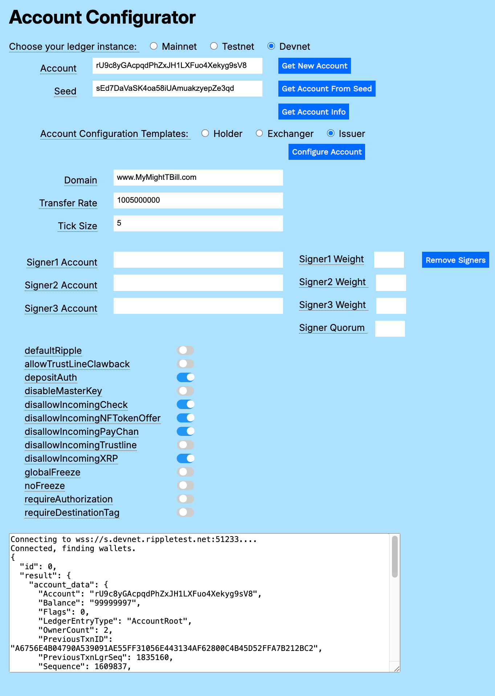
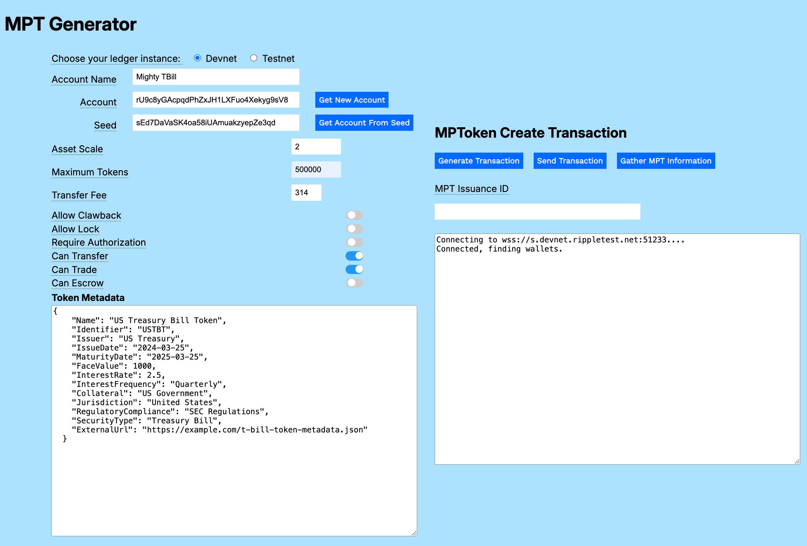
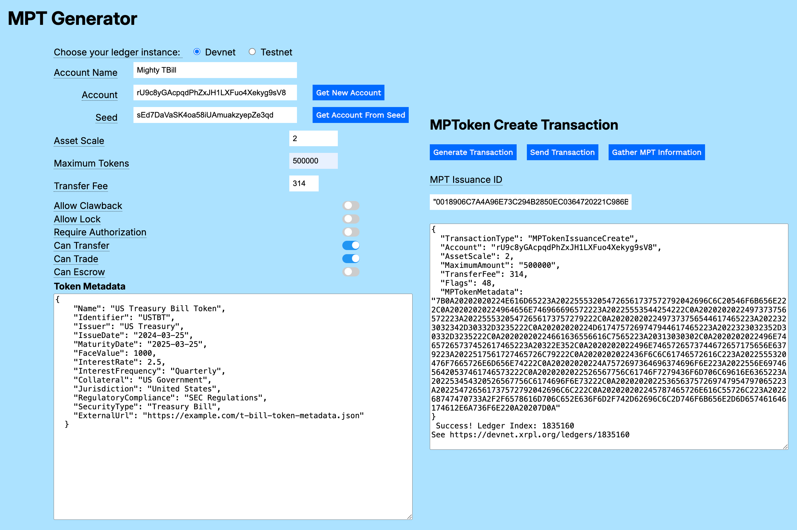
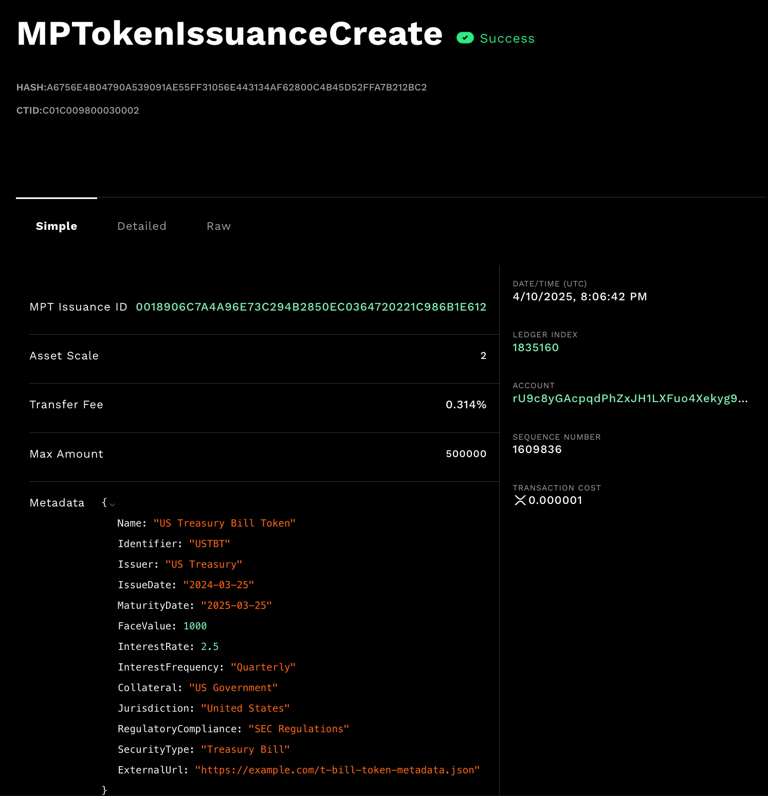

---
seo:
    description: Issue an asset-backed token such as a US Treasury bill using multi-purpose tokens.
labels:
  - Tokens
  - MPT
---
# Creating an Asset-backed Multi-purpose Token

_As a financial professional, I want to use multi-purpose tokens to create an asset-backed token in order to profit from resale transactions._

A multi-purpose token (MPT) is a compact and flexible type of token that offers the best aspects of fungible and non-fungible tokens. It is the next generation of tokenization on the XRPL. Notable features include:

- MPTs store metadata directly on the XRPL blockchain, with the option of linking to additional off-chain data.
- MPTs can have a fixed token supply, with a cap on the maximum number of tokens.
- MPT issuers can collect transfer fees each time the token is traded.
- MPTs can be non-transferable, for use cases such as airline credits.
- MPTs also allow advanced compliance features.

To learn more, see [Multi-purpose Tokens](../../concepts/tokens/fungible-tokens/multi-purpose-tokens.md).

## MPT Generator

The MPT Generator utility lets you experiment with an MPT configuration in a sandbox environment. When you are satisfied with the settings, you can generate the transaction code required to create your MPT on Mainnet.

In practice, you want to use an Issuer account configuration to issue an MPT, but you can try the form below with a new account and the transaction works fine. See [Creating a US Treasury Bill](#creating-a-us-treasury-bill) for a full description of the issuance process. The form is populated with sample values, but you can change the parameters for your own experiments. A T-bill is just one example of the many types of asset you can create and trade on the XRP Ledger.

<hr/>
<div>
    <link href='https://fonts.googleapis.com/css?family=Work Sans' rel='stylesheet'>
    <script src='https://unpkg.com/xrpl@4.1.0/build/xrpl-latest.js'></script> 

<script src='https://unpkg.com/xrpl@4.1.0/build/xrpl-latest.js'></script> 
<script>
    document.addEventListener("DOMContentLoaded", function() {
        getNewAccountButton.addEventListener("click", getAccount)
        getAccountFromSeedButton.addEventListener("click", getAccountFromSeed)
        generateCodeButton.addEventListener("click", generateCode)
        sendTransactionButton.addEventListener("click", sendTransaction)
 })
function getNet() {
    let net
    if (document.getElementById("tn").checked) net = "wss://s.altnet.rippletest.net:51233"
    if (document.getElementById("dn").checked) net = "wss://s.devnet.rippletest.net:51233"
    return net
  } // End of getNet()           
  // *******************************************************
  // ************* Get Account *****************************
  // *******************************************************
  async function getAccount() {
    let net = getNet()
    const client = new xrpl.Client(net)
    results = 'Connecting to ' + net + '....'
  //-------------------------------This uses the default faucet for Testnet/Devnet.
    let faucetHost = null
    console.log(results)
    await client.connect()
    results += '\nConnected, funding wallet.'
  // ----------------------------------------Create and fund a test account wallet.
    const my_wallet = (await client.fundWallet(null, { faucetHost })).wallet
    results += '\nGot a wallet.'
  // ------------------------------------------------------Get the current balance.
    const my_balance = (await client.getXrpBalance(my_wallet.address))  
    accountField.value = my_wallet.address
    seedField.value = my_wallet.seed
    results += '\nAccount created.'
    console.log(results)
    client.disconnect()
  } // End of getAccount()
    if (typeof module !== "undefined") {
    const xrpl = require("xrpl")
}
  async function getAccountFromSeed() {
    let net = getNet()
    const client = new xrpl.Client(net)
    results = 'Connecting to ' + getNet() + '....'
    await client.connect()
    results += '\nConnected, finding wallets.\n'
    console.log(results)
  // --------------------------------------------------Find the test account wallet.    
    const my_wallet = xrpl.Wallet.fromSeed(seedField.value)    
  // -------------------------------------------------------Get the current balance.
    accountField.value = my_wallet.address
    seedField.value = my_wallet.seed      
    client.disconnect()
  } // End of getAccountFromSeed()
  function generateCode() {
    let v_flags = 0
    if (clawbackSlider.checked) {v_flags+=64}
    if (lockSlider.checked) {v_flags+=2}
    if (authTokenSlider.checked) {v_flags +=4}
    if (txrSlider.checked) {v_flags += 32}
    if (tradeSlider.checked) {v_flags += 16}
    if (escrowSlider.checked) {v_flags+=8}
    const mptHexString = xrpl.convertStringToHex(metadataTextArea.value)
    let v_codeBlock = "{\n  \"TransactionType\": \"MPTokenIssuanceCreate\",\n  \"Account\": \"" + accountField.value +
    "\",\n  \"AssetScale\": 2, \n  \"MaximumAmount\": \"" + maximumAmountField.value +
    "\",\n  \"TransferFee\": " + transferFeeField.value +
    ",\n  \"Flags\": " + v_flags + ",\n  \"MPTokenMetadata\": \"" + mptHexString +  "\"\n}"
    codeTextArea.value = v_codeBlock
}
  // *******************************************************
  // *************** Send Transaction **********************
  // *******************************************************
async function sendTransaction() {
  let v_flags = 0
  if (clawbackSlider.checked) {v_flags+=64}
  if (lockSlider.checked) {v_flags+=2}
  if (authTokenSlider.checked) {v_flags +=4}
  if (txrSlider.checked) {v_flags += 32}
  if (tradeSlider.checked) {v_flags += 16}
  if (escrowSlider.checked) {v_flags+=8}
  results = 'Connecting to ' + getNet() + '....'
  console.log(results)
  let net = getNet()
  const my_wallet = xrpl.Wallet.fromSeed(seedField.value)
  const client = new xrpl.Client(net)
  await client.connect()
const metadataHexString = xrpl.convertStringToHex(metadataTextArea.value)
const transactionJson = {
  "TransactionType": "MPTokenIssuanceCreate",
  "Account": accountField.value,
  "AssetScale": parseInt(assetScaleField.value),
  "MaximumAmount": maximumAmountField.value,
  "TransferFee": parseInt(transferFeeField.value),
  "Flags": v_flags,
  "MPTokenMetadata": metadataHexString
}
  const tx = await client.submitAndWait(transactionJson, { wallet: my_wallet} )
  client.disconnect()
  if (document.getElementById("tn").checked) {
    successURLfield.value += "https://testnet.xrpl.org/ledgers/" + tx.result.ledger_index
  } else {
    successURLfield.value = "https://devnet.xrpl.org/ledgers/" + tx.result.ledger_index
  }
} //End of sendTransaction()

</script>
<div>
    <link href='https://fonts.googleapis.com/css?family=Work Sans' rel='stylesheet'>
    <script src='https://unpkg.com/xrpl@4.1.0/build/xrpl-latest.js'></script> 
    <!-- Required meta tags -->
    <meta charset="utf-8">
    <meta name="viewport" content="width=device-width, initial-scale=1, shrink-to-fit=no">
    <!-- Bootstrap CSS -->
    <link rel="stylesheet" href="https://cdn.jsdelivr.net/npm/bootstrap@4.0.0/dist/css/bootstrap.min.css" integrity="sha384-Gn5384xqQ1aoWXA+058RXPxPg6fy4IWvTNh0E263XmFcJlSAwiGgFAW/dAiS6JXm" crossorigin="anonymous">
    <div class="container">
        <div class="row">
            <div class="col align-self-start">
              <b>1. Choose your preferred network.</b>
            </div>
            <div class="col align-self-center">
              <input type="radio" id="tn" name="server"
                  value="wss://s.altnet.rippletest.net:51233">
              <label for="testnet">Testnet</label>
              <br/>
              <input type="radio" id="dn" name="server"
                  value="wss://s.devnet.rippletest.net:51233" checked>
              <label for="devnet">Devnet</label>
            </div>
        </div>
        <div class="row">
            <div class="col align-self-start">
              <b>2. Get a new account or retrieve one from its seed.</b><br/>
            </div>
            <div class="col align-self-start">
                Account: <input type="text" id="accountField" size="40"></input>
                Seed: <input type="text" id="seedField" size="40"></input>
            </div>
            <div class="col align-self-start">
              <button type="button" id="getNewAccountButton" class="btn btn-primary">Get New Account</button><br/><br/>
              <button type="button" id="getAccountFromSeedButton" class="btn btn-primary">Get Account From Seed</button>
            </div>
        </div>
        <p>
        <div class="row">
          <div class="col align-self-start">
            <b>3. Enter parameter values for your new MPT.</b>
          </div>
        </div>
        <div class="row">
          <div class="col align-right">
            Asset Scale:
          </div>
          <div class="col align-self-start">
            <input type="text" size="10" id="assetScaleField" value="2"/>
          </div>
        </div>
        <div class="row">
          <div class="col align-right">
            Maximum Tokens:
          </div>
          <div class="col align-self-start">
            <input type="text" size="10" id="maximumAmountField" value="1000000"/>
          </div>
        </div>
        <div class="row">
          <div class="col align-right">
            Transfer Fee:
          </div>
          <div class="col align-self-start">
            <input type="text" size="10" id="transferFeeField" value="314"/>
          </div>
        </div>
        <div class="row"><p></div>
        <div>
        <div class="row">
          <div class="col align-self-start">
            <b>4. Set flags for your new MPT.</b>
          </div>
      </div>
      <div class="row">
        <div class="col align-self-start">
          Clawback
        </div>
        <div class="col align-self-start">
            <input type="checkbox" id="clawbackSlider">
        </div>
      </div>
      <div class="row">
        <div class="col align-self-start">
          Lock
        </div>
        <div class="col align-self-start">
            <input type="checkbox" id="lockSlider">
        </div>
      </div>
      <div class="row">
        <div class="col align-self-start">
          Require Authorization
        </div>
        <div class="col align-self-start">
            <input type="checkbox" id="authTokenSlider">
        </div>
      </div>
      <div class="row">
        <div class="col align-self-start">
          Can Transfer
        </div>
        <div class="col align-self-start">
            <input type="checkbox" id="txrSlider" checked>
        </div>
      </div>
      <div class="row">
        <div class="col align-self-start">
          Can Trade
        </div>
        <div class="col align-self-start">
            <input type="checkbox" id="tradeSlider">
        </div>
      </div>
      <div class="row">
        <div class="col align-self-start">
          Can Escrow
        </div>
        <div class="col align-self-start">
            <input type="checkbox" id="escrowSlider">
        </div>
      </div>
      <div class="row">
        <div class="col align-self-start">
          <b>5. Enter the token metadata.</b>
        </div>
      </div>
      <div class="row">
        <div class="col align-self-start">
          <textarea id="metadataTextArea" rows="18" cols="60" 
            value='{
    "Name": "US Treasury Bill Token",
    "Identifier": "USTBT",
    "Issuer": "US Treasury",
    "IssueDate": "2024-03-25",
    "MaturityDate": "2025-03-25",
    "FaceValue": 1000,
    "InterestRate": 2.5,
    "InterestFrequency": "Quarterly",
    "Collateral": "US Government",
    "Jurisdiction": "United States",
    "RegulatoryCompliance": "SEC Regulations",
    "SecurityType": "Treasury Bill",
    "ExternalUrl": "https://example.com/t-bill-token-metadata.json"
}'> </textarea>
        </div>
    </div>
    <div class="row">
        <div class="col-align-items-left">
        <br/>
          <p><b>6.</b> Click <b>Generate Transaction</b><br/>
             <button type="button" id="generateCodeButton" class="btn btn-primary">Generate Transaction</button>
          </p>
          </div>
    </div>
    <div class="row">
        <div class="col-align-self-start">
          <p><b>MPToken Create Transaction</b></p>
          <textarea id="codeTextArea" rows="18" cols="60">
        </div>
    </div>
    <div class="row">
        <div class="col-align-self-start">
            <br/>
            <p><b>7.</b> Click <b>Send Transaction</b><br/>
            <button type = "button" id="sendTransactionButton" class="btn btn-primary">Send Transaction</button>
          </p>
          <p>
          <b>8. Follow the URL to your new T-bill.</b>
          </p>
          <input type="text" id="successURLfield" size="60"></input>
        </div>
      </div>
    </div>
  </div>
</div>
</div>
<hr/>

## Creating a US Treasury Bill

A US Treasury bill (T-bill) is a short-term debt security issued by the US government. T-bills are considered a safe investment because they're backed by the US government. T-bills are appealing to investors in American states that have high income tax because the interest earned is exempt from state and local taxes. See [Treasury Bills In Depth](https://www.treasurydirect.gov/research-center/history-of-marketable-securities/bills/t-bills-indepth/).

A T-bill is just one of the many asset-backed tokens you can create and trade as an MPT on the XRP Ledger.

### Creating an Issuing Account

You can use the Account Configurator to experiment with the settings for a T-bill issuing account in a sandbox environment. When you are satisfied with your configuration, you can create an account on XRPL Mainnet to begin trading.

To create a new MPT Issuer account:
- In the Account Configurator utility, choose ledger instance **Devnet**.
- Click **Get New Account**.
- Choose account configuration template **Issuer**.

The form sets the standard flags for an Issuer account and displays additional configuration fields.



| Parameter | Value | Description |
|-----------|-------|-------------|
| **Domain** | _TOML domain_ | URL to the server where your TOML file is stored. For an experimental account, you can enter any URL. When you configure the account, the domain is automatically converted to a hexidecimal string. If you reconfigure the account, you need to enter the original domain again. |
| **Transfer Rate** | 1005000000 | A value between 1000000000 and 2000000000 representing the percentage value you collect when a holder transfers one of your issued tokens. A Transfer Rate of 1005000000 returns .5% of the transfer value to this account. See [Transfer Rate](../../references/protocol/transactions/types/accountset.md#transferrate). |
| **Tick Size** | 5 | Round offers to this many significant digits. Valid values are 3 to 15, or 0 to disable. |
| **Signer Accounts** | _account addresses_ | Accounts that have a vote regarding approval of transactions for this account. |
| **Signer Weights** | _int_ | The weight of each signer's signature, relative to other signers. |
| **Signer Quorum**  | _int_ | The required minimum value of signer weights to approve a transaction. |

#### Issuer Account Flag Settings

Use the sliders to configure the standard suggested flag settings. Overall, you want holders of your T-bill to be able to trade with other holders, so rippling is an essential function. You want to be careful about what other accounts are able to send to your account, so you should disallow most types of transfers. One exception is trust lines, which you do want other accounts to be able to create to your issuing account.

|Flag                          |Purpose                                                                             |
|------------------------------|------------------------------------------------------------------------------------|
| defaultRipple                | Allow transfers to third-party holders by default.                                 |
| depositAuth                  | Require authorization for another account to deposit to this account.              |
| disallowIncomingCheck        | Prevent other accounts from sending checks to this account.                        |
| disallowIncomingNFTokenOffer | Prevent other accounts from sending NFTokenOffers to this account.                 |
| disallowIncomingPayChan      | Prevent other accounts from creating Payment Channels to this account.             |
| disallowIncomingXRP          | Prevent other accounts from sending XRP to this account.                           |

Once you've set your preferred values in the account configurator, click **Configure Account** to finish preparing your account to issue T-bills.

### Generating a US Treasury Bill as a Multi-purpose Token

You can represent a US Treasury Bill (T-bill) on the XRPL by creating a multi-purpose token. The example below shows random possible values you might use as a starting point. Adjust as needed for your use case.



| Parameter | Value | Description |
|-----------|-------|-------------|
| Asset Scale | 2 | The difference, in orders of magnitude, between a standard T-bill unit and the corresponding fractional unit. |
| Maximum Tokens | 500000 | The maximum number of this T-bill MPT that will ever be issued by this account. |
| Transfer Fee   | 314    | Fee collected when the T-bill MPT is transferred to another account.            |

As an example, you might set the following flags when creating your T-bill MPT.

| Flag | Description |
|------|-------------|
| Can Transfer | A holder can transfer the T-bill MPT to another account. |
| Can Trade    | A holder can trade the T-bill MPT with another account. |

#### Token Metadata

The metadata you provide is what distinguishes your token from other MPTs. The following JSON definition shows sample configuration information for a T-bill. Copy and paste the data, or your own metadata, into the **Token Metadata** field.

```json
{
    "Name": "US Treasury Bill Token",
    "Identifier": "USTBT",
    "Issuer": "US Treasury",
    "IssueDate": "2024-03-25",
    "MaturityDate": "2025-03-25",
    "FaceValue": 1000,
    "InterestRate": 2.5,
    "InterestFrequency": "Quarterly",
    "Collateral": "US Government",
    "Jurisdiction": "United States",
    "RegulatoryCompliance": "SEC Regulations",
    "SecurityType": "Treasury Bill",
    "ExternalUrl": "https://example.com/t-bill-token-metadata.json"
  }
```
Once you've set your preferred values, click **Generate Code** to see the transaction syntax for your settings. The `Flags` field displays the sum of the flags you've selected, and the `MPTokenMetadata` is converted to a hexidecimal string.


To create your T-bill MPT, click **Send Transaction**. When your transaction succeeds, a link to the record in the XRPL Explorer is displayed in the Code field.



Follow the link and scroll down to find the `MPTokenIssuanceCreate` transaction for your new T-bill in the Explorer.

